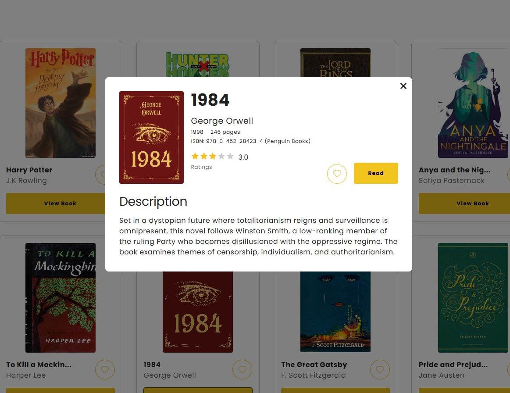

# Libary Management System




## TechStack

- React
- React Context API (State Management)
- Scss
- Axios

## Features

- Book list
- Book details
- Filter by title, exact matching, authors, publisher, yearfrom, yearto
- Filter to select languages, but it’s not working because the API isn’t providing the languages
- Sort by (title, author, publication date)
- Navbar
- Sidebar

## Prerequisites

- Node.js
- npm or yarn or pnpm or bun for package management

## Installation

1. Clone the repository

```bash
https://github.com/vjvic/library-management-system.git

```

2.  Navigate to project directory

```bash
cd library-management-system

```

3. Install the dependencies:

```bash
npm install

```

## Usage

1. Start the development server

```bash
npm run dev

```

2. Access the application in your browser at http://localhost:3000.

# Components

## Button

### Usage

```jsx
<Button size="large" variant="primary" onClick={() => console.log("Clicked")}>
  Large Primary Button
</Button>
```

### Props

| Prop        | Type                                        | Default     | Description                                                  |
| ----------- | ------------------------------------------- | ----------- | ------------------------------------------------------------ |
| `size`      | `"small"` \| `"medium"` \| `"large"`        | `"medium"`  | Defines the button size.                                     |
| `variant`   | `"default"` \| `"primary"` \| `"secondary"` | `"default"` | Defines the button style variant.                            |
| `fullWidth` | `boolean`                                   | `false`     | If `true`, the button takes the full width of its container. |
| `disabled`  | `boolean`                                   | `false`     | If `true`, the button is disabled and unclickable.           |
| `onClick`   | `function`                                  | `undefined` | Callback function triggered when the button is clicked.      |
| `children`  | `React.ReactNode`                           | `undefined` | The content inside the button (e.g., text or elements).      |
| `iconLeft`  | `React.ReactNode`                           | `undefined` | Icon displayed on the left side of the button.               |
| `iconRight` | `React.ReactNode`                           | `undefined` | Icon displayed on the right side of the button.              |
| `textLight` | `boolean`                                   | `false`     | If `true`, applies a lighter text style for contrast.        |

## Searchbar

### Usage

```jsx
import SearchBar from "./SearchBar";

<SearchBar
  placeholder="Search..."
  value={searchValue}
  onChange={handleSearchChange}
  name="search"
/>;
```

### Props

| Prop          | Type       | Default     | Description                                                |
| ------------- | ---------- | ----------- | ---------------------------------------------------------- |
| `placeholder` | `string`   | `undefined` | The placeholder text to display inside the input field.    |
| `value`       | `string`   | `undefined` | The current value of the input field.                      |
| `onChange`    | `function` | `undefined` | Callback function triggered when the input value changes.  |
| `name`        | `string`   | `undefined` | The `name` attribute for the input element, used in forms. |

## Pagination

### Usage

```jsx
import Pagination from "./Pagination";

//pagination logic
const booksPerPage = 10; // 10 book limit per page
const totalPages = Math.ceil(filteredBookList.length / booksPerPage); //calculate the total page example we have 100 books totalpage is 10
const displayedBooks = filteredBookList.slice(
  // this is the book list after filter and paginate
  (currentPage - 1) * booksPerPage, //start
  currentPage * booksPerPage //end
);

// function for changing page
const handlePageChange = (newPage) => {
  if (newPage >= 1 && newPage <= totalPages) {
    setCurrentPage(newPage);
  }
};

<Pagination
  currentPage={currentPage}
  totalPages={totalPages}
  onPageChange={handlePageChange}
/>;
```

### Props

| Prop           | Type       | Default     | Description                                        |
| -------------- | ---------- | ----------- | -------------------------------------------------- |
| `currentPage`  | `number`   | `undefined` | The current active page number.                    |
| `totalPages`   | `number`   | `undefined` | The total number of pages available.               |
| `onPageChange` | `function` | `undefined` | Callback function triggered when the page changes. |

## Dropdown

### Usage

```jsx
import Dropdown from "./Dropdown";

<Dropdown
  options={["Option 1", "Option 2", "Option 3"]}
  onChange={handleDropdownChange}
/>;
```

### Props

| Prop          | Type                 | Default              | Description                                                                                            |
| ------------- | -------------------- | -------------------- | ------------------------------------------------------------------------------------------------------ |
| `options`     | `array`              | `[]`                 | An array of options to be displayed in the dropdown.                                                   |
| `bordered`    | `boolean`            | `false`              | If `true`, adds a border to the dropdown.                                                              |
| `placeholder` | `string`             | `"Select an option"` | Placeholder text to display when no option is selected.                                                |
| `onChange`    | `function`           | `undefined`          | Callback function triggered when an option is selected. It receives an object with the selected value. |
| `size`        | `"small" \| "large"` | `undefined`          | Defines the size of the dropdown. Can be either `small` or `large`.                                    |

## Checkbox

### Usage

```jsx
import Checkbox from "./Checkbox";

<Checkbox
  size="small"
  checked={isChecked}
  onChange={handleCheckboxChange}
  label="Accept terms and conditions"
/>;
```

### Props

| Prop       | Type                             | Default     | Description                                                     |
| ---------- | -------------------------------- | ----------- | --------------------------------------------------------------- |
| `size`     | `"small" \| "medium" \| "large"` | `"medium"`  | The size of the checkbox. Can be `small`, `medium`, or `large`. |
| `disabled` | `boolean`                        | `false`     | If `true`, disables the checkbox and prevents interaction.      |
| `checked`  | `boolean`                        | `false`     | If `true`, the checkbox is checked.                             |
| `onChange` | `function`                       | `undefined` | Callback function triggered when the checkbox state changes.    |
| `label`    | `string`                         | `undefined` | The label to display next to the checkbox.                      |
| `name`     | `string`                         | `undefined` | The `name` attribute for the checkbox input element.            |

## Bookcard

### Usage

```jsx
import BookCard from "./BookCard";

const book = {
  title: "Book Title",
  author: "Book Author",
  cover: "https://link-to-cover-image.com",
  description: "This is a description of the book...",
  pageNumber: 300,
  rating: 4.5,
  releaseDate: "2023-01-01",
  isbn: "978-1234567890",
};

<BookCard book={book} />;
```

### Props

| Prop               | Type     | Default     | Description                                                                                                                                           |
| ------------------ | -------- | ----------- | ----------------------------------------------------------------------------------------------------------------------------------------------------- |
| `book`             | `object` | `undefined` | An object containing the details of the book, including `title`, `author`, `cover`, `description`, `pageNumber`, `rating`, `releaseDate`, and `isbn`. |
| `book.title`       | `string` | `undefined` | The title of the book.                                                                                                                                |
| `book.author`      | `string` | `undefined` | The author of the book.                                                                                                                               |
| `book.cover`       | `string` | `undefined` | The URL of the book's cover image.                                                                                                                    |
| `book.description` | `string` | `undefined` | A description of the book.                                                                                                                            |
| `book.pageNumber`  | `number` | `undefined` | The number of pages in the book.                                                                                                                      |
| `book.rating`      | `number` | `undefined` | The rating of the book (e.g., out of 5).                                                                                                              |
| `book.releaseDate` | `string` | `undefined` | The release date of the book.                                                                                                                         |
| `book.isbn`        | `string` | `undefined` | The ISBN number of the book.                                                                                                                          |

## Modal Overlay

### Usage

```jsx
import Modal from "./Modal";
import { useState } from "react";
import { MdOutlineClose } from "react-icons/md";

const App = () => {
  const [isModalOpen, setIsModalOpen] = useState(false);

  return (
    <div>
      <button onClick={() => setIsModalOpen(true)}>Open Modal</button>
      <Modal isOpen={isModalOpen} onClose={() => setIsModalOpen(false)}>
        <h2>Modal Title</h2>
        <p>This is the modal content.</p>
      </Modal>
    </div>
  );
};

export default App;
```

### Props

| Prop Name  | Type        | Default    | Description                                                                     |
| ---------- | ----------- | ---------- | ------------------------------------------------------------------------------- |
| `isOpen`   | `boolean`   | `false`    | Controls whether the modal is visible. Pass `true` to show and `false` to hide. |
| `onClose`  | `function`  | `() => {}` | Callback function triggered when the close button is clicked.                   |
| `children` | `ReactNode` | `null`     | The content displayed inside the modal.                                         |

## Sidebar

### Usage

```jsx
import Sidebar from "./Sidebar";

const App = () => {
  const [isSidebarOpen, setIsSidebarOpen] = useState(false);

  const toggleSidebar = () => {
    setIsSidebarOpen(!isSidebarOpen);
  };

  return (
    <div>
      <Sidebar isOpen={isSidebarOpen} toggleSidebar={toggleSidebar} />
      <button onClick={toggleSidebar}>Toggle Sidebar</button>
    </div>
  );
};

export default App;
```

### Props

| Prop            | Type   | Default     | Description                                                                                  |
| --------------- | ------ | ----------- | -------------------------------------------------------------------------------------------- |
| `isOpen`        | `bool` | `false`     | A boolean that determines if the sidebar is open or closed.                                  |
| `toggleSidebar` | `func` | `undefined` | A function to toggle the sidebar visibility. It is typically used to open/close the sidebar. |

## Navbar

### Usage

```jsx
import { useState } from "react";
import Navbar from "./Navbar";
import { FiUser } from "react-icons/fi";

const App = () => {
  const [isSidebarOpen, setIsSidebarOpen] = useState(false);

  const toggleSidebar = () => {
    setIsSidebarOpen(!isSidebarOpen);
  };

  return (
    <div>
      <Navbar toggleSidebar={toggleSidebar} />
      <button onClick={toggleSidebar}>Toggle Sidebar</button>
      <div>{isSidebarOpen ? "Sidebar is open" : "Sidebar is closed"}</div>
    </div>
  );
};
```

### Props

| Prop            | Type   | Default     | Description                                                                                                              |
| --------------- | ------ | ----------- | ------------------------------------------------------------------------------------------------------------------------ |
| `toggleSidebar` | `func` | `undefined` | A function to toggle the sidebar visibility. Typically used to show or hide the sidebar when the menu button is clicked. |

# Project Walkthrough: Reusable Components in My Project

## Dropdown component

I implemented a Dropdown component that could be used anywhere in the app where a list of options is needed. It provides options like customizable size, border styles, placeholder text, and callback functions for option selection.

### Key Decisions

- State Management: I used React's useState and useEffect hooks to manage and update the selected option in the dropdown.

- Flexibility: I allowed the dropdown to be used with a variety of configurations, such as size, bordered, and onChange. These props ensure that it can fit different UI designs and provide flexibility to the parent components.

- Accessibility: I ensured that the dropdown could be opened and closed via a button and that clicking outside the dropdown would close it. I achieved this by using useRef and useEffect to detect clicks outside of the dropdown.

## Reusable Button Component

I created a Button component to standardize button behavior across the app. The button can be configured with different types (primary, secondary, etc.), sizes, and disabled states.

### Key Decisions

- Style Variants: I used SCSS to define different styles for button types. The button accepts a type prop which determines its appearance.

- Accessibility: Buttons are accessible by default, but I added a disabled state to ensure the button is visually styled as disabled and doesn't trigger actions when clicked.

## Searchbar Component

### Key Decisions

- Simplicity & Reusability: The design is kept minimal and clean, focusing on ease of use and reusability. It can be dropped into any part of the app that requires a search feature.

## Pagination Component

### Key Decisions

- Dynamic Page Rendering: I used the Array constructor to generate page numbers based on the totalPages prop. This allows the component to adjust automatically, whether there are 2 pages or 20, ensuring flexibility without extra code changes.

- Reusability & Customization The component accepts currentPage, totalPages, and onPageChange as props, allowing it to work seamlessly with different datasets and parent components. It’s also designed to hide itself if there’s only one page, reducing unnecessary UI clutter.

## Siderbar Component

### Key Decisions

- Dynamic Menu Rendering: The sidebar items are generated from the sidebarData array, making it easy to add, remove, or update menu items without modifying the core logic. This improves flexibility and reduces repetitive code.

- Active Item Highlighting: I used useState to track the currently active menu item. When a menu item is clicked, it updates the active state, applying the active CSS class for clear visual feedback.

- Conditional Badge Display: A notification badge is conditionally displayed next to the "Favorites" menu item (id === 2), showing hardcoded data ("24") for demonstration. This feature can be extended for dynamic notifications.

## Navbar Component

### Key Decisions

- Sidebar Toggle Integration: The menu button triggers the toggleSidebar function passed as a prop. This allows the Navbar to control the sidebar’s visibility, especially useful for mobile responsiveness.
  Brand Identity:

- The logo is placed prominently next to the menu button, reinforcing brand visibility. It’s imported as an SVG for better scalability and performance.

- Responsive Design: The structure supports a responsive layout, with the sidebar toggle enhancing usability on smaller screens.

## Bookcard Component

### Key Decisions

- State Management: I used useState to manage the showOverlay state, which controls the visibility of the book detail modal when the "View Book" button is clicked.

- I ensured the button spans the full width using the fullWidth prop for consistency in layout across different screen sizes.

## Checkbox Component

### Key Decisions

- Customizable Sizes: The size prop allows the checkbox to be rendered in small, medium (default), or large sizes. I used dynamic class assignment to handle size-based styling.

- Conditional Label: The label prop is optional. It only renders if provided, making the component flexible for use cases where no label is needed.
